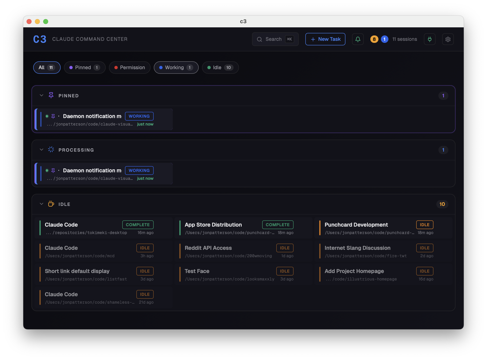

<p align="center">
  
</p>

# C3 — Claude Command Center

C3 is a visualizer for the [Claude Code](https://docs.anthropic.com/en/docs/claude-code) notification hook pattern I use with my Ghostty + tmux setup.

When running lots of projects in parallel, I found notifications helpful to quickly get back to whatever Claude needed input on. For users who are less tmux-inclined or who want an easier introduction, this program may be helpful to make you more productive with Claude Code.

<p align="center">
  
</p>

## Features

- **Real-time session monitoring** — See all active Claude Code sessions at a glance
- **State tracking** — Know which sessions need permission, are processing, waiting for input, or complete
- **Desktop notifications** — macOS notifications via terminal-notifier with click-to-focus on the right tmux pane
- **Background mode** — Close the window and C3 keeps running in the menu bar, still sending notifications
- **Keyboard-driven** — Navigate sessions with vim-style keys, fuzzy search with `Cmd+K`
- **Click-to-focus** — Jump directly to any session's tmux pane
- **Session tagging & pinning** — Organize sessions by project or priority
- **Hook-based updates** — Sub-second state changes via Claude Code hooks (with tmux scanner fallback)

## Requirements

- macOS
- [tmux](https://github.com/tmux/tmux)
- [Claude Code](https://docs.anthropic.com/en/docs/claude-code)
- [jq](https://jqlang.github.io/jq/) — for hook script JSON processing
- [terminal-notifier](https://github.com/julienXX/terminal-notifier) — for desktop notifications with click-to-focus

## Install

### Homebrew (recommended)

```bash
brew tap illustriousdevelopment/c3
brew install --cask c3
```

### Manual

Download the latest `.dmg` from [Releases](https://github.com/illustriousdevelopment/c3/releases), open it, and drag C3 to Applications.

## Setup

### Automatic (recommended)

Open C3, go to **Settings** (gear icon), and click **Install C3 Hooks**. This will:

1. Check for required dependencies
2. Install the hook script to `~/.local/bin/c3-hook.sh`
3. Install the notification icon to `~/.config/c3/icon.png`
4. Configure Claude Code hooks in `~/.claude/settings.json`

### CLI setup

```bash
./setup.sh
```

Or from anywhere:

```bash
curl -fsSL https://raw.githubusercontent.com/illustriousdevelopment/c3/main/setup.sh | bash
```

### Manual setup

See [hooks/SETUP.md](hooks/SETUP.md) for step-by-step instructions.

## Usage

1. Start C3
2. Open Claude Code in tmux panes as usual
3. Sessions appear automatically in the C3 dashboard
4. Close the window — C3 keeps running in the menu bar and still sends notifications
5. Click the tray icon or use "Show C3" to bring the window back

### Keyboard shortcuts

| Key | Action |
|-----|--------|
| `Cmd+K` | Fuzzy search sessions |
| `j` / `k` | Navigate sessions |
| `Enter` | Focus session terminal |
| `1-9` | Quick jump to session |
| `D` | Toggle debug panel |
| `?` | Show keyboard shortcuts |
| `Esc` | Close dialog / deselect |

## How it works

C3 uses two mechanisms to track Claude Code sessions:

1. **Hooks** (primary) — Claude Code hooks fire shell commands on `PermissionRequest`, `Notification`, `Stop`, and `SessionStart` events. The `c3-hook.sh` script sends these to C3's local HTTP endpoint (`http://127.0.0.1:9398/hook`), which updates session state and fires desktop notifications via terminal-notifier.

2. **Tmux scanner** (fallback) — Periodically scans tmux for panes running Claude, parsing conversation files from `~/.claude/projects/` to determine state. Lower frequency, but ensures nothing is missed.

## Development

### Prerequisites

- [Rust](https://rustup.rs/)
- [Node.js](https://nodejs.org/) 20+
- [Tauri CLI](https://v2.tauri.app/start/prerequisites/)

### Run locally

```bash
npm install
npm run tauri dev
```

### Build

```bash
npm run tauri build
```

## License

[MIT](LICENSE)
